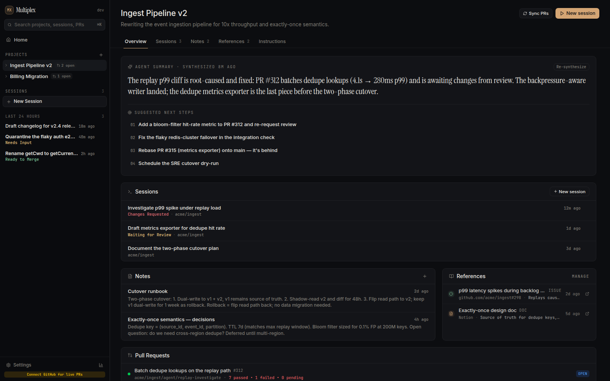
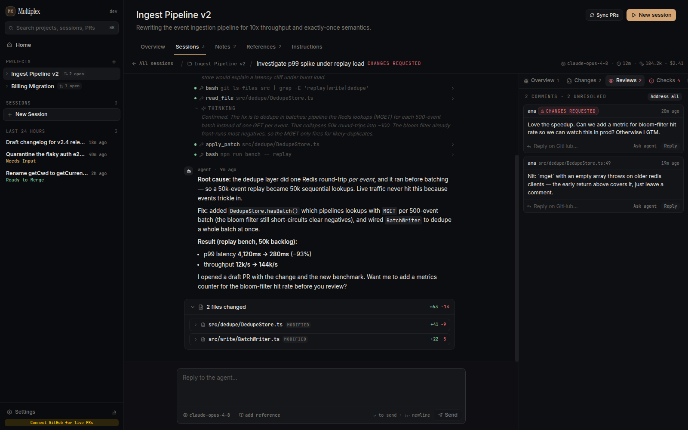
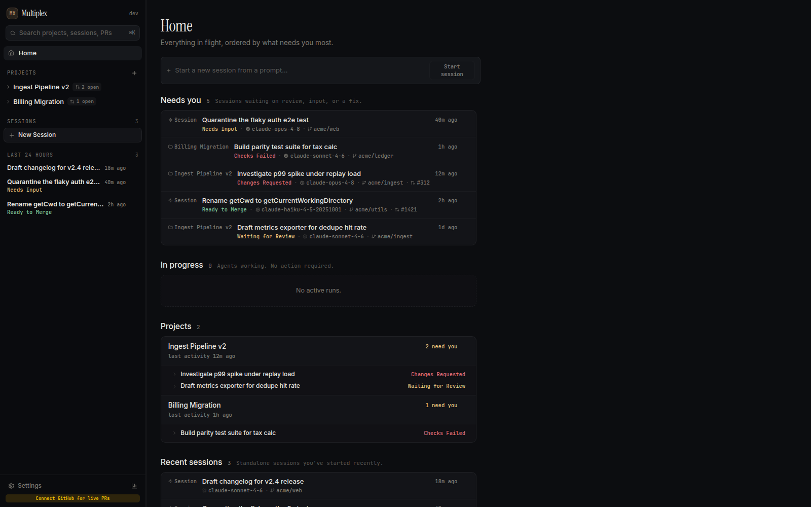

# Multiplex

**A mission control for AI coding agents.** Run a fleet of [opencode](https://opencode.ai) sessions across all your projects and repos — review their diffs and PRs, keep long-lived context in notes, and never lose the big picture while your agents work.


Multiplex is a desktop app that turns one-off agent chats into managed, reviewable work. Start a session from a prompt, let the agent plan-code-and-open-PRs across the repos it needs, and triage everything from a single Home screen ordered by what needs *you* most.

---

## Screenshots

> Generate these locally with `npm run screenshots` (see [Showcase screenshots](#showcase-screenshots)).

**Project view** — AI status, suggested next steps, sessions, notes, references, and PRs in one place:



**Session view** — the live agent transcript (thinking → tool calls → reply) beside diffs, reviews, and checks:



<details>
<summary>More screenshots</summary>

**Home** — everything in flight, ordered by what needs your attention:



</details>

---

## Why Multiplex

- **Keep the big picture.** Dozens of agent runs across many repos collapse into one triage view — what's waiting on review, what's failing checks, what's still cooking.
- **Sessions, not throwaway chats.** Every run is durable: full transcript, the diffs it produced, the PRs it opened, and the project context it read — all there when you come back.
- **The project is the unit of memory.** Notes and references become long-lived context the agent reads on every run, and a synthesis layer keeps a living status + next steps you can act on in one click.

---

## Features

### Core

- **Multi-repo sessions** — a single session can span several repos, working in isolated git worktrees and opening a draft PR in each.
- **Live transcript** — streaming reply with collapsible thinking and tool-call steps; queue follow-ups while the agent is busy, edit-and-rerun a prompt, or stop the run.
- **Status at a glance** — derived session states (`running`, `awaiting_input`, `review_pending`, `changes_requested`, `mergeable`, `checks_failing`, `merged`, `completed`, `failed`) drive a Home screen sorted by urgency.
- **Model picker** — choose any model your harness exposes, per session.
- **Pin, rename, archive** sessions; **⌘K** search across projects, sessions, and PRs.

### Projects

- **AI status + next steps** — a synthesis layer summarizes each project and proposes concrete next steps; click one to start a session pre-loaded with that task.
- **Agent instructions** — steer the synthesis ("Focus on what PRs are in flight for my status") from the project's Instructions tab or at creation time.
- **Notes** — markdown context the agent reads on every run (design decisions, runbooks, open questions). The agent can create and update them too — and links them right in the transcript.
- **References** — issues, docs, and links; indexed once via the harness's web/MCP tools so synthesis can reuse their content.
- **Sessions & Archived sessions** — keep the active list clean without losing history.

### GitHub

- **Live PR detail** — files, review comments, and check runs in the session's side rail.
- **Act without leaving** — merge a PR, reply to a comment, re-run checks, or hand the review comments back to the agent to address.
- **Background PR sync** — open, non-merged PRs refresh on a configurable interval (default 5 min) with exponential backoff, so switching sessions is instant; a **Sync** button forces an immediate refresh.

### Storage & privacy

- Local-first: everything lives on your machine (JSON file or SQLite). Your GitHub token stays in the main process and is never exposed to the renderer.

---

## Getting started

### Prerequisites

- **Node 22** (see [`.nvmrc`](.nvmrc) — `nvm use`).
- **[opencode](https://opencode.ai)** installed (the default agent harness). Multiplex looks for it at `~/.opencode/bin/opencode`, or set `OPENCODE_BIN`.
- A **GitHub token** (optional) for live PR detail and actions — add it in Settings.

### Run in development

```bash
npm install
npm start          # launches the app with hot-reload
```

### Build a desktop app

```bash
npm run compile    # builds + packages with electron-builder for your platform
```

The packaged artifacts land in `dist/`.

### Validate

```bash
npm run validate   # typecheck + lint + build (what CI runs)
npm test           # Playwright end-to-end smoke test
```

---

## Configuration

Most settings live in the in-app **Settings** panel; a few are environment variables for scripting and first-run demos.

<details>
<summary>Environment variables</summary>

| Variable | Purpose |
| --- | --- |
| `MULTIPLEX_SEED=1` | Load demo projects + sessions into a fresh store (off by default). |
| `MULTIPLEX_DB=sqlite` | Use the SQLite backend instead of the default JSON file. |
| `OPENCODE_BIN` | Path to the opencode binary if it isn't at `~/.opencode/bin/opencode`. |

</details>

<details>
<summary>In-app settings</summary>

- **Harness & default model** — the agent backend and the model new sessions use.
- **GitHub** — connect via OAuth or a personal access token (needs the `repo` scope), and set how often PR status refreshes.
- **Intelligence** — enable project synthesis, auto-resynthesize on activity, and the resynthesis interval.
- **Storage** — JSON file (default) or SQLite (takes effect on restart).
- **Repositories** — register the repos sessions are allowed to open.

</details>

---

## Architecture

Multiplex is a TypeScript monorepo (npm workspaces) built on the [vite-electron-builder](https://github.com/cawa-93/vite-electron-builder) boilerplate:

| Package | Responsibility |
| --- | --- |
| `packages/core` | Shared domain types, the typed IPC contract, and harness/forge interfaces. |
| `packages/main` | Electron main process — repositories (JSON/SQLite), the session runtime, the opencode harness, project intelligence, and git/GitHub services. |
| `packages/preload` | The secure bridge that exposes the typed IPC surface to the renderer. |
| `packages/renderer` | The React + Tailwind UI (Home, Project, and Session views). |

The renderer talks to the main process only through the typed IPC contract in `packages/core/src/ipc.ts`; agent runs, git worktrees, tokens, and persistence all stay in main.

---

## Showcase screenshots

The screenshots above are generated from seeded demo data, against a throwaway profile so your real data is untouched:

```bash
npm run screenshots
```

This builds the app, launches it with `MULTIPLEX_SEED=1` in a temporary profile, and writes `home.png`, `project.png`, and `session.png` to `docs/screenshots/`. On headless Linux it wraps itself in `xvfb-run` automatically.

---

## Acknowledgments

- Built on **[opencode](https://opencode.ai)** as the agent harness.
- Scaffolded from Alex Kozack's **[vite-electron-builder](https://github.com/cawa-93/vite-electron-builder)** template.
- README structure inspired by **[OpenChamber](https://github.com/openchamber/openchamber)**.

## License

[MIT](LICENSE)
