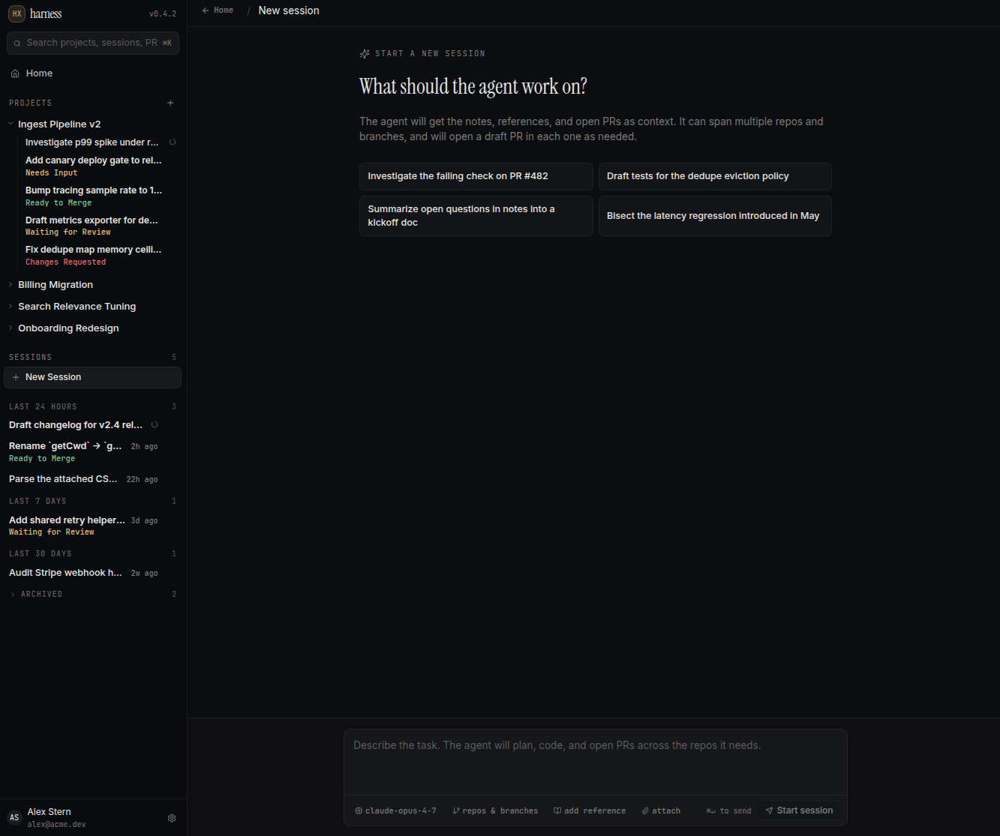
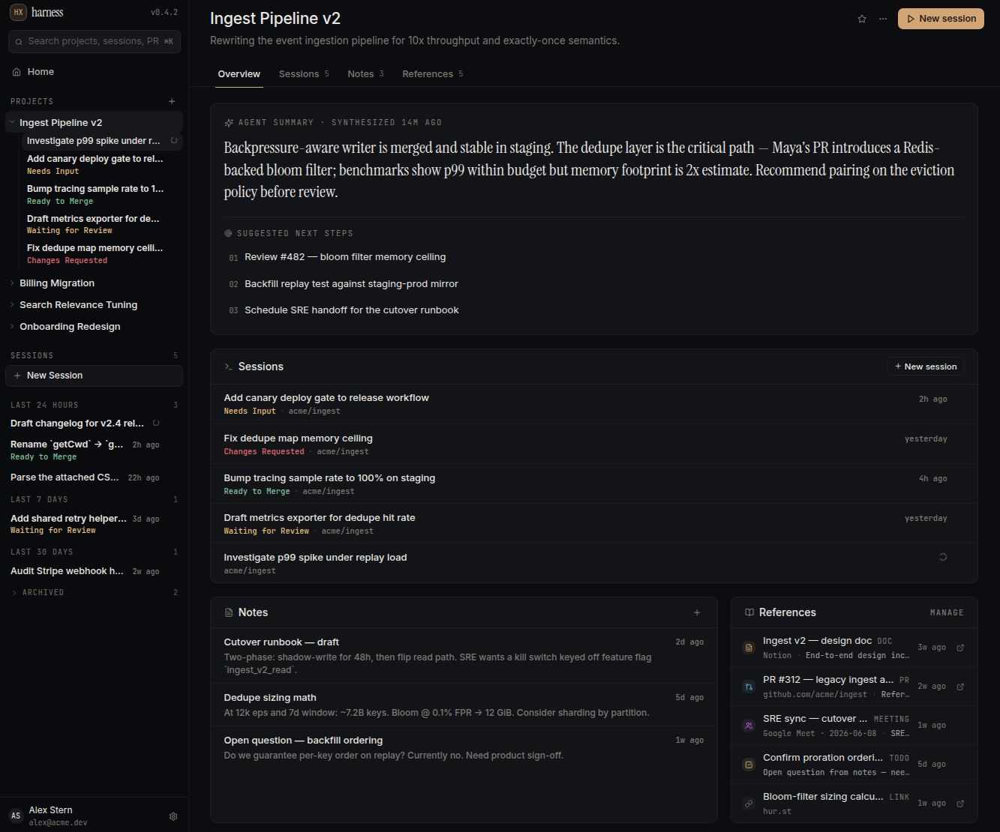
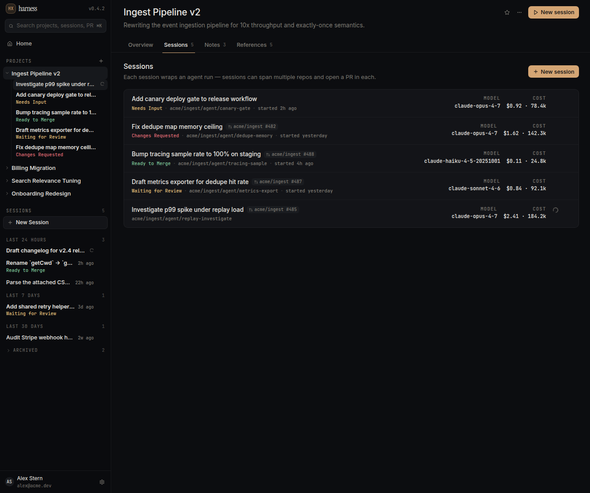
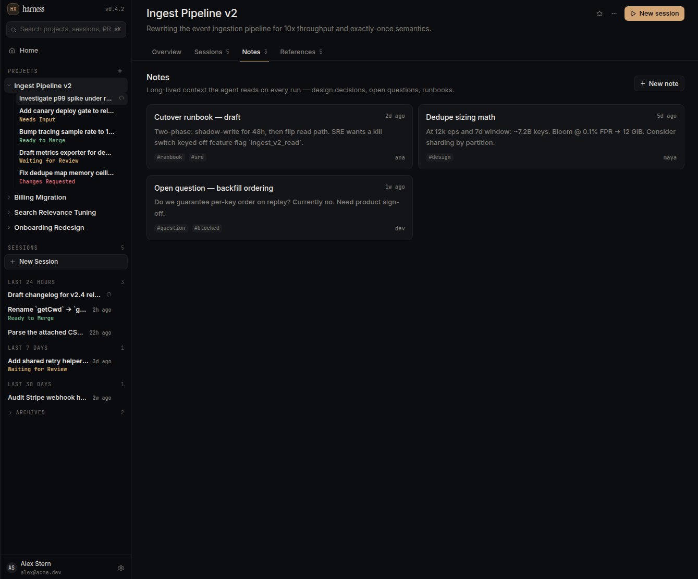
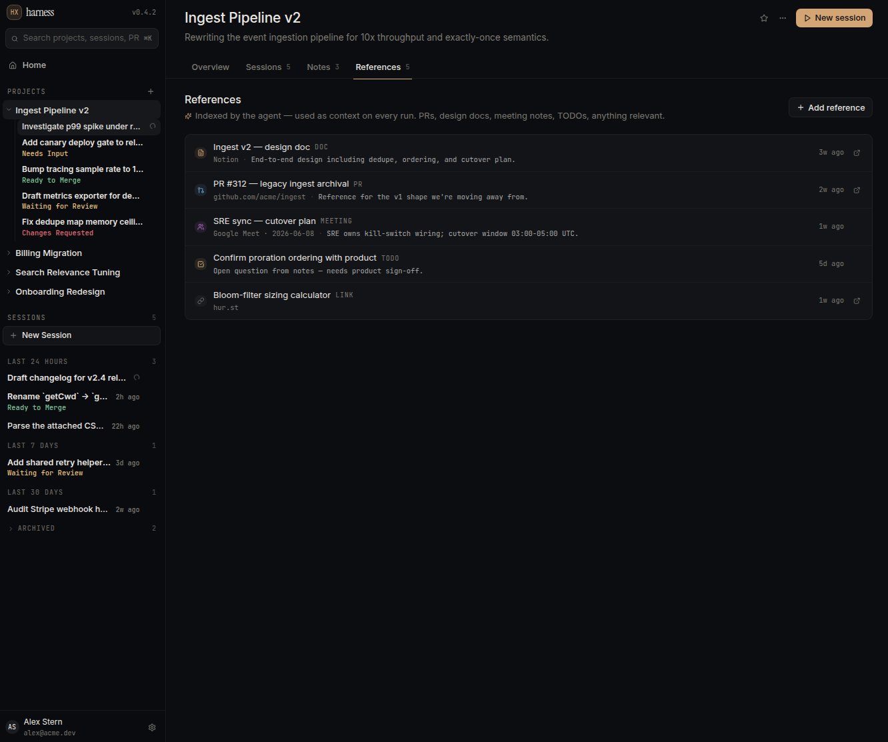
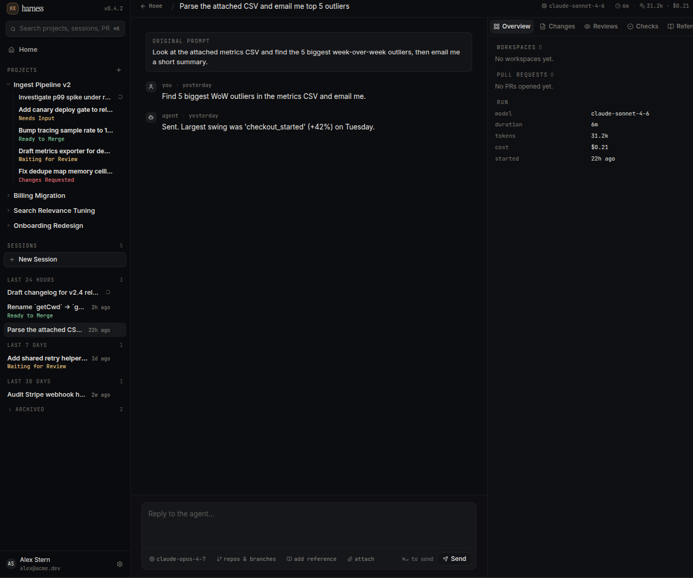
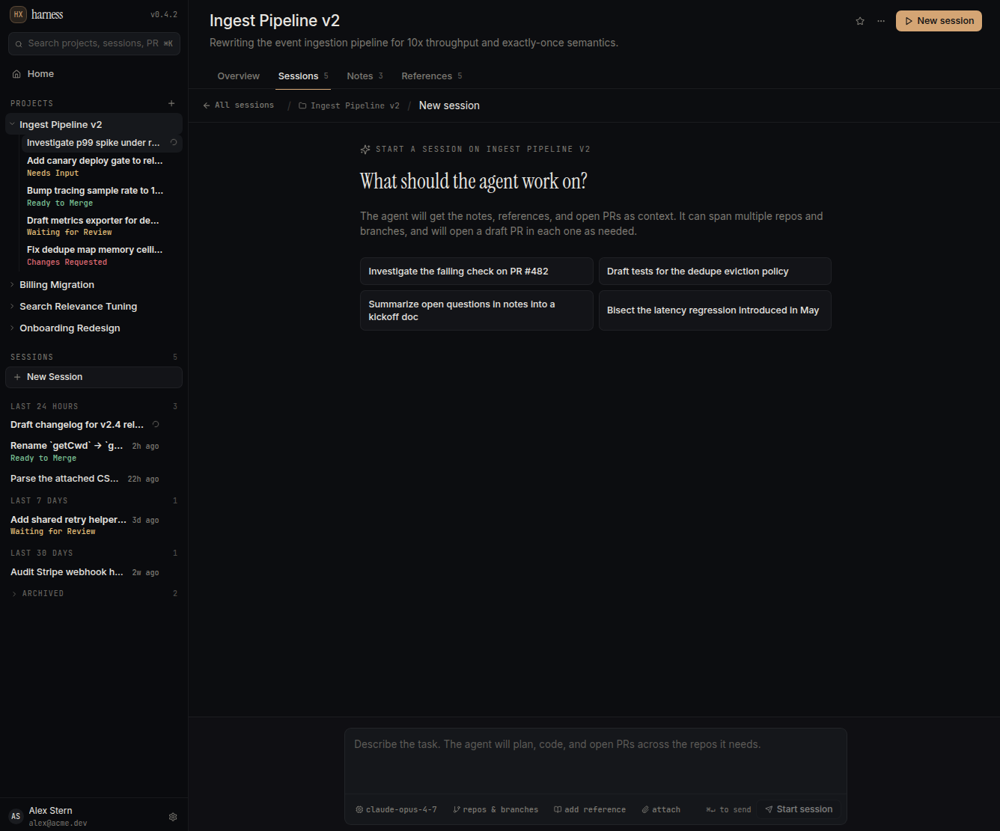

# Multiplex — Product Description

> A project-centric AI development environment. Multiplex runs coding agents
> organized around long-lived projects instead of disposable chats, and offloads
> the work of *project tracking* to the product itself — using LLMs to keep an
> always-current picture of where a project stands and what should happen next.

---

## 1. What Multiplex is

Multiplex is a desktop application where engineers put AI agents to work and let
the product keep the books. Today an engineer who delegates work to an agent
still has to hold the project in their own head: which PRs are in flight, what's
blocked on review, what the agent learned last week, what decision is still open,
what to do next. Multiplex's bet is that an LLM can do that bookkeeping better
than a human juggling tabs — *if* it sits on top of the actual work product
(sessions, PRs, reviews, checks, notes, and references) rather than a separate
ticket tracker that drifts out of date.

The product is therefore two things at once:

1. **An agent workbench** — a place to start sessions, watch agents code across
   one or more repositories, review the PRs they open, respond to review
   comments, and merge.
2. **A project intelligence layer** — an LLM that continuously reads everything
   happening across a project and answers the two questions an engineer actually
   has: *"Where are we?"* and *"What's next?"*

The organizing principle of the entire UI is **triage**: surface what needs the
human, in priority order, and let everything else recede.

> The mockups below use an early placeholder wordmark ("harness") in the title
> bar; the product name is **Multiplex**.

---

## 2. Who it's for

- **The delegating engineer** — runs multiple agents in parallel and needs to
  know, at a glance, which ones are waiting on them.
- **The tech lead / project owner** — owns a multi-repo initiative and needs a
  trustworthy, current summary of status and risk without chasing people.
- **Anyone doing one-off agent tasks** — "parse this CSV," "rename this symbol" —
  who wants a fast lane that doesn't require setting up a project first.

---

## 3. Core concepts (domain model)

These are the nouns the product is built from. Every requirement later refers
back to them.

| Concept | What it is | Key properties |
| --- | --- | --- |
| **Project** | A long-lived container for a body of work. Spans one or more repos. | name, description, status (`active` / `paused` / `shipped`), progress %, repos[], LLM-written summary, suggested next steps, and collections of sessions / notes / references / PRs / activity. |
| **Session** | A single unit of agent work, started from a prompt. May belong to a project or stand alone. | title, original prompt, status (lifecycle), model, workspaces[], linked PRs[], conversation messages, duration, tokens, cost, references[]. |
| **Workspace** | One repo + branch (optionally a worktree) a session is operating in. A session can have several. | repo, branch, worktree. |
| **Note** | Long-lived, human- or agent-authored context the agent reads on *every* run — design decisions, open questions, runbooks. | title, body, author, tags[], updatedAt. |
| **Reference** | An external artifact indexed and summarized by the agent, used as context on every run. | kind (`pr` / `doc` / `link` / `meeting` / `todo` / `issue`), title, source, url, agent-extracted summary. |
| **Pull Request** | A PR opened by a session (or tracked from a repo). | number, repo, branch → base, status, mergeability, review verdict, files (diffs), review comments, check runs, +/− counts. |
| **Activity** | The append-only event stream of a project. | kind (pr / session / note / summary / ref), text, timestamp. |

The crucial relationships: **a project aggregates many sessions**, **a session
can span many repos and open a PR in each**, and **notes + references are the
durable context that every session in a project inherits.**

---

## 4. The defining capability: LLM-driven project tracking

This is the part that makes Multiplex more than an agent runner. The product
**must** provide a continuously-maintained "project intelligence" layer.

**R-INTEL-1 — Synthesized project summary.** Every project must show a narrative
summary, written by an LLM from the project's real state (merged work, in-flight
PRs, failing checks, open questions in notes), with a visible freshness stamp
(e.g. *"Agent summary · synthesized 14m ago"*). The summary should read like a
sharp status update, naming the critical path and current risk — not a list of
metrics.

**R-INTEL-2 — Suggested next steps.** Each project must present an ordered,
short list of concrete next actions derived from current state (e.g. *"Review
#482 — bloom filter memory ceiling," "Backfill replay test against staging,"
"Schedule SRE handoff for the cutover runbook"*). Each step should be actionable
and, where possible, link to the thing it's about.

**R-INTEL-3 — Lifecycle awareness.** The product must express where a project is
in its lifecycle: a status (`active` / `paused` / `shipped`) and a progress
indication, kept current from real signals rather than manual edits.

**R-INTEL-4 — Triage across everything.** The product must rank all in-flight
work by how much it needs the human and present the highest-priority items
first, both within a project and globally on Home (see §5 and §9).

**R-INTEL-5 — Context inheritance.** Notes and references must be automatically
supplied to every agent run in a project. The product must make this contract
explicit to the user (e.g. *"Long-lived context the agent reads on every run,"*
*"Indexed by the agent — used as context on every run"*).

**R-INTEL-6 — Daily / rolling synthesis.** The product should periodically
regenerate project summaries and emit a synthesis event into the activity
stream (e.g. *"Daily summary generated — 3 PRs touched, 1 milestone
advanced"*).

---

## 5. Surfaces & functional requirements

Multiplex has four primary surfaces: **Home**, **Project**, **Session**, and the
persistent **left navigation**. Requirements are grouped by surface and tied to
the reference mockups.

### 5.1 Home — "Everything in flight, ordered by what needs you most"

The landing surface is a global triage dashboard, not a project list.

- **R-HOME-1** Show a **"Needs you"** section: every session (project-scoped or
  standalone) currently waiting on the human — review pending, input needed,
  changes requested, checks failing, ready to merge — sorted by priority weight,
  most urgent first.
- **R-HOME-2** Show an **"In progress"** section: agents actively running, with a
  clear "no action required" affordance.
- **R-HOME-3** Show a **"Projects"** roster, each row summarizing how many of its
  sessions *need you* vs. are *running* vs. *idle*, with inline jump-links to the
  attention-needing sessions.
- **R-HOME-4** Show **"Recent sessions"** — recently started standalone sessions.
- **R-HOME-5** Provide an always-available **prompt bar** to start a new session
  from anywhere ("Start a new session from a prompt…").
- **R-HOME-6** Empty states must be explicit and reassuring (e.g. *"Nothing is
  waiting on you right now."*).

### 5.2 Project view

The project view is tabbed: **Overview · Sessions · Notes · References** (each
tab badged with a count). A persistent header shows the project name, one-line
description, a "New session" call-to-action, favorite/star, and overflow menu.

#### Overview tab

- **R-PROJ-1** Lead with the **agent summary** and **suggested next steps**
  (R-INTEL-1, R-INTEL-2).
- **R-PROJ-2** Show the project's **sessions**, sorted so attention-needing
  sessions rise to the top, each with title, state, and the repos it touches.
- **R-PROJ-3** Show a **Notes** preview and a **References** preview, each with a
  shortcut to its full tab and an add affordance.
- **R-PROJ-4** Show a **Recent activity** feed of the project's event stream.

#### Sessions tab

- **R-PROJ-5** List all sessions in the project with: title, state label, the
  repo/branch workspace(s), model used, and cost/token spend per session.
- **R-PROJ-6** Running sessions must show live motion (spinner) rather than a
  timestamp.
- **R-PROJ-7** Provide "New session" entry that pre-scopes the session to this
  project (see §5.4).

#### Notes tab

- **R-PROJ-8** Present notes as a card grid; each card shows title, body excerpt,
  tags, author, and last-updated. Caption the purpose: *"Long-lived context the
  agent reads on every run — design decisions, open questions, runbooks."*
- **R-PROJ-9** Support creating, editing, and tagging notes ("+ New note").

#### References tab

- **R-PROJ-10** Present references as a list, each with a **type badge** (DOC /
  PR / MEETING / TODO / LINK / ISSUE), a source label, the agent-extracted
  one-line summary, an added-time, and an open-externally affordance.
- **R-PROJ-11** Caption the purpose: *"Indexed by the agent — used as context on
  every run. PRs, design docs, meeting notes, TODOs, anything relevant."*
- **R-PROJ-12** Support adding a reference ("+ Add reference"); the product
  should infer the reference kind and fetch/summarize it.

### 5.3 Session view

The session view is the agent workbench: a conversation on the left, a contextual
**right rail** on the right, and a composer at the bottom.

- **R-SESS-1 Header** — show the session title, current state label (colored only
  when it needs attention), and live run meta: model, duration, token count,
  cost. Running sessions must expose a **Stop** control.
- **R-SESS-2 Conversation** — render the original prompt distinctly, then the
  full transcript of `user` / `agent` / `tool` messages. Tool output is visually
  differentiated (monospace block). While running, show an "agent is thinking…"
  affordance.
- **R-SESS-3 Composer** — a reply box with: model selector, repos & branches
  picker, "add reference," and attach. Submit via button or ⌘↵. On a new session
  the same composer reads "Describe the task…" and the button says "Start
  session."
- **R-SESS-4 Right rail** — a tabbed inspector that can collapse to an icon rail.
  Tabs, each badged with a count: **Overview · Changes · Reviews · Checks ·
  References**. The rail must **auto-open to the tab that needs attention** —
  Reviews if changes are requested, Checks if something is failing, else
  Overview.

Right-rail tab requirements:

- **R-SESS-5 Overview rail** — list the session's **Workspaces** (repo/branch),
  its **Pull Requests** (each with verdict pill, check summary, an open-on-GitHub
  link, and a Merge button that is enabled only when truly mergeable: clean +
  approved + checks green + not already merged), and a **Run** block (model,
  duration, tokens, cost, started-at).
- **R-SESS-6 Changes rail** — list changed files across *all* the session's PRs,
  grouped by repo when multi-repo, with per-file +/− counts, a change-kind badge
  (added / modified / deleted / renamed), and an expandable diff hunk with
  add/remove line coloring. Show a roll-up total.
- **R-SESS-7 Reviews rail** — list all review comments across PRs: review
  verdicts, inline comments (with file:line), and threaded replies. Each comment
  supports **Reply** and **Ask agent** (hand the comment to the agent to
  address). Provide an **"Address all"** bulk action and an unresolved count.
- **R-SESS-8 Checks rail** — list CI check runs across PRs with status icons
  (success / failure / pending / skipped), durations, failure detail text, an
  overall health summary, and a **Re-run** action.
- **R-SESS-9 References rail** — show the session's references (inherited from
  the project plus session-specific), labeled "indexed by agent," with the
  ability to add one inline.

### 5.4 New session flow

- **R-NEW-1** A focused composer headed *"What should the agent work on?"* with
  an explicit statement of the contract: *"The agent will get the notes,
  references, and open PRs as context. It can span multiple repos and branches,
  and will open a draft PR in each one as needed."*
- **R-NEW-2** Offer **starter prompt** suggestions (context-aware when launched
  from a project).
- **R-NEW-3** Allow starting from anywhere: Home prompt bar, sidebar "New
  Session," project "New session," or the Overview tab.
- **R-NEW-4** When started from a project, scope and breadcrumb the new session
  to that project; standalone sessions are scoped to no project.

### 5.5 Navigation (left sidebar)

Visible in every project/session mockup.

- **R-NAV-1** Global **search** across projects, sessions, and PRs (⌘K).
- **R-NAV-2** **Projects** list (collapsible per project, revealing that
  project's sessions inline with their states).
- **R-NAV-3** **Sessions** area with a "New Session" button and standalone
  sessions **bucketed by recency**: *Last 24 hours / Last 7 days / Last 30 days /
  Older / Archived*, each bucket badged with a count.
- **R-NAV-4** Persistent **Home** entry and a user/account footer with settings.

---

## 6. Session lifecycle & triage model

The status model is core product behavior, not cosmetic. The product **must**
implement these session states and map each to a triage **tone** and a priority
**weight** (higher = more urgent). Color is applied *only* to the three
"needs-attention" tones so that urgency reads instantly; everything else stays
neutral.

| State | Label shown | Tone | Needs human? |
| --- | --- | --- | --- |
| `awaiting_input` | Needs Input | warning | **Yes (highest)** |
| `checks_failing` | Checks Failed | danger | **Yes** |
| `failed` | Failed | danger | **Yes** |
| `changes_requested` | Changes Requested | danger | **Yes** |
| `mergeable` / `mergeable_comments` | Ready to Merge | success | **Yes** |
| `review_pending` | Waiting for Review | warning | **Yes** |
| `running` | Running | neutral (+ spinner) | No |
| `idle` | Idle | neutral | No |
| `merged` | Merged | neutral | No |
| `completed` | Completed | neutral | No |

- **R-LIFE-1** Every list of sessions (Home, project Overview, project Sessions)
  must sort by weight so the most-urgent work surfaces first.
- **R-LIFE-2** State must be derived from real signals — review verdicts, check
  results, mergeability, agent prompts for input — not manually set.
- **R-LIFE-3** `running` must render continuous motion wherever it appears.
- **R-LIFE-4** A merge action must be gated on genuine mergeability (clean
  branch + approved + checks passed + not already merged).

---

## 7. Multi-repo & cross-repo coordination

A first-class requirement, not an edge case.

- **R-MULTI-1** A project may declare multiple repos; a session may open
  workspaces and PRs across several of them.
- **R-MULTI-2** Changes, Reviews, and Checks rails must aggregate across all of a
  session's PRs and clearly attribute each item to its repo/PR when more than one
  is involved.
- **R-MULTI-3** The product must represent **coordinated PRs with ordering
  dependencies** (e.g. a consumer PR gated on a shared-library PR landing first)
  and communicate that gating to the user.

---

## 8. Agent capabilities (requirements on the agent)

The agent behind a session must be able to:

- **R-AGENT-1** Plan and execute a task end-to-end: read context, write code,
  run tools, and open draft PRs across the repos it needs.
- **R-AGENT-2** Consume project notes, references, and open PRs as context on
  every run (R-INTEL-5).
- **R-AGENT-3** Operate on non-code tasks too (analysis, drafting, audits) — not
  every session produces a PR (a workspace-less session is valid).
- **R-AGENT-4** Respond to review comments on request ("Ask agent" / "Address
  all") and push follow-up changes.
- **R-AGENT-5** Be model-selectable per session (e.g. Opus / Sonnet / Haiku),
  with the chosen model surfaced in run metadata.
- **R-AGENT-6** Emit a structured transcript of user/agent/tool turns.

---

## 9. Observability & cost

- **R-OBS-1** Track and display per-session **duration, token usage, and cost**,
  in the header and the Run block.
- **R-OBS-2** Aggregate spend should be legible at the project level (per-session
  cost is shown in session lists).
- **R-OBS-3** Maintain a per-project **activity stream** capturing session
  starts, PR events, note/reference changes, and summary generation.

---

## 10. Non-functional requirements

- **R-NFR-1 Desktop-native.** Multiplex ships as a cross-platform desktop app
  (Electron: macOS / Windows / Linux) with auto-update.
- **R-NFR-2 Security.** Follow Electron security best practices — context
  isolation, no Node integration in the renderer, IPC boundary via preload — so
  repo access and credentials never leak into the web layer.
- **R-NFR-3 Local-first feel.** The triage dashboard, project views, and session
  lists must remain responsive with many concurrent sessions and PRs.
- **R-NFR-4 Visual language.** A calm, dark, information-dense aesthetic:
  monospace for metadata/identifiers, a display serif for headline questions,
  and color reserved strictly for states that need attention.
- **R-NFR-5 Keyboard-first.** Core actions (search ⌘K, send ⌘↵, new session)
  are reachable from the keyboard.

---

## 11. Out of scope (for this description)

- Team collaboration / multi-user presence and permissions.
- Self-hosted or web-hosted deployment of the agent backend.
- Integrations beyond the reference kinds shown (Notion, Linear, Google
  Docs/Meet, GitHub) — these are illustrative, not an exhaustive integration
  spec.
- Billing, quotas, and admin.

---

## 12. Success criteria

Multiplex succeeds when an engineer can:

1. Open the app and, in seconds, know exactly **what needs them** and in what
   order — without opening a single PR.
2. Ask a project *"where are we and what's next?"* and trust the answer because
   it was synthesized from the real work, not a stale board.
3. Delegate a multi-repo task to an agent and shepherd it from prompt → PRs →
   review → green checks → merge **without leaving the product**.
4. Run a quick one-off task without the ceremony of setting up a project.
